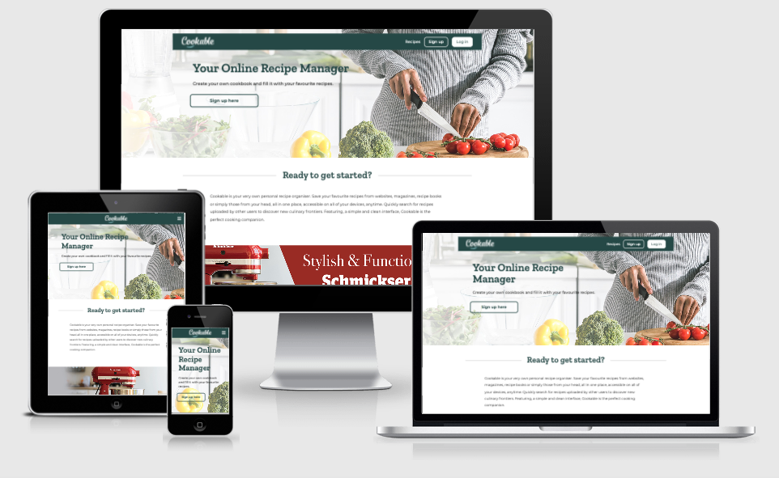

# __Cookable__ - Your Online Recipe Manager

_Cookable_ is your very own personal recipe organiser. Save your favourite recipes from websites, magazines, recipe books or simply those from your head, all in one place, accessible on all of your devices, anytime. Quickly search for recipes uploaded by other users to discover new culinary frontiers.



# Link to live project - [CLICK HERE](http://cookable.herokuapp.com/landing)

#### Contents
1. [UX](#ux)
	- [User Goals (Strategy)](#user-goals)
	- [Stakeholder Goals (Strategy)](#stakeholder-goals)
	- [User Stories (Strategy)](#user-stories)
	- [Project Scope (Scope)](#project-scope)
	- [Information Architecture - Game Flow Chart (Structure)](#information-architecture---game-flow-chart)
	- [Wireframes (low fidelity wireframes) (Skeleton)](#wireframes-(low-fidelity))
	- [Prototype (high fidelity wireframes) (Skeleton)](#prototype-(high-fidelity))
	- [Design (Surface)](#design)
2. [Features](#features)
	- [Landing Page](#landing-page)
    - [How to Play Page](#how-to-play-page)
    - [The Game](#the-game)
    - [Score track](#score-track)
    - [Eliminated Cards Track](#eliminated-cards-track)
    - [End of the Game Message](#end-of-the-game-message)
	- [Features to Implement in the Future](#features-to-implement-in-the-future)
3. [Technologies](#technologies)
	- [Tools](#tools)
	- [Libraries](#libraries)
	- [Languages](#languages)
4. [Testing](#testing)
	- [Automated Testing](#automated-testing)
	- [UX Testing](#ux-testing)
	- [Manual Testing](#manual-testing)
	- [Bugs](#bugs)
5. [Deployment](#deployment)
    - [Github Pages Deployment](#github-pages-deployment)
    - [Cloning](#cloning)
6. [Credits](#credits)
	- [Content](#content)
	- [Media](#media)
	- [Code](#code)
    - [Resources](#resources)
	- [Acknowledgements](#acknowledgements)
7. [Contact](#contact)


---


## UX

### User Goals.
- Upload, store and easily access own cooking recipes on the _Cookable_ recipe manager.
- Browse and find recipes uploaded by other users.

### Stakeholder Goals
- Promote the 'Schmickser' brand of kitchen mixers.
- Creating a crowd-populated resource for cooking recipes.

### User Stories

1. As a first time user, I want the website to be simple and easy to navigate, I want all links to be available in the navbar.
2. As a website user that accesses internet primarily via mobile, I want the website to be fully responsive, with clean and simple layout and also easy to navigate.
3. As a user who looks only for cooking inspiration, I would like to be able to browse and find other people's recipes. It would be ideal if I could do it without having to create an account myself. 
4. As a person who likes to cook from recipes I find online, I expect the recipes to have at the minimum all the basic information needed for the meals to be actually possible to cook. Any nutritional information would be a nice bonus.
5. As a user who is looking for specific recipes, I expect the website to have some form of search feature, so I can find recipes by a particular ingredient or any other keyword.
6. As a visitor who is looking to become a registered user, I would like to see an easy way to register my account. I also make typos easily..., I would like to see some defensive mechanism preventing me confusing the password at the registration, or alternatively, I would like to see password recovery feature.
7. As a registered user, I expect an easy way to upload and view my recipes. I would like to share my recipes with other users, both regisered and unregisered.
8. As a registered user, I would like an easy way to update and delete my recipes. However, I would like to make sure that other users could not modify or delete my recipes. 
9. As a registered user, I would like to receive a feedback from the website at any point that my account has been affected in any way (uploading/ updating/ deleting recipe confirmation etc.)
10. As a registered user, I would like to have some way of categorising recipes, so that it is easier to search for a group of similar recipes (or similar ingredients, etc.)
11. As a user, I would like to be able to get in touch with the website owner, to ask a question, perhaps to suggest a new recipe category or leave any other feedback.
12. As the website owner, I want to add an advert for the 'Schmickser' brand of mixers to any recipe that contains the keywords 'mix' or 'mixer'.
13. As the website owner, I want some form of validation of any entry by the users, so that the website layout or database content doesn't break or doesn't get corrupted.
14. As the website owner, I want some form of validation of usernames and passwords entries at the sign up level, so that the database doesn't get populated by possibly corrupting entries. Also I don't want users to get frustrated and leave the website when they forget passwords, therefore some form of prevention from using overly complicated entries must be in place.
15. As the website owner, I want the features that are available to registered users to be concealed from non-registered users.
16. As the website owner I expect to be able to add new recipe categories, and edit or delete existing categories.
17. As the website owner I want the '404 - page not found' error to be handled in the way that makes visitors stay on Cookable website, so that accidental mispellings in the web address bar or any other issues don't take them elsewhere.


### Project Scope
content ...

Features:
- content ...

### Information Architecture - Website Flow Chart


### Wireframes (low fidelity)
- [Wireframes for the website AVAILABLE HERE](https://indd.adobe.com/view/...)

### Prototype (high fidelity)
- [Prototype - desktop version of the website AVAILABLE HERE](https://xd.adobe.com/view/...)
- [Prototype - mobile version of the website AVAILABLE HERE](https://xd.adobe.com/view/...)

### Design

#### The Name
content ...

#### Logo
content ...


#### Colours
content ...


#### Typography
content ...


[Back to top](#contents)

---

## Features
### Home Page
content ...


### Features to Implement in the Future
- content ...


[Back to top](#contents)

---

## Technologies
### Tools
- [GitHub](https://github.com) was an IDE used for the project.
- [GitPod](https://gitpod.io/workspaces/) was used for version control.
- [Balsamiq](https://balsamiq.com) was used to create low fidelity wireframes.
- [Adobe XD](https://www.adobe.com/ie/products/xd.html) was used to build the high fidelity prototypes.
- [Adobe Illustrator](https://www.adobe.com/ie/products/illustrator.html) was used to ...
- [Adobe Photoshop](https://www.adobe.com/ie/products/photoshop.html) was used to edit, crop and save images.
- [Am I Responsive](http://ami.responsivedesign.is) was used to create the images of each page displayed on different screen sizes in this _Readme_ file.

### Libraries
- [Bootstrap](https://getbootstrap.com/) grids were used in particular to create and maintain the design layout across different screen/viewport sizes and make the website responsive easily.
- [Google Fonts](https://fonts.google.com) was used to link the "Montserrat" font.
- [Font Awesome](https://fontawesome.com) was used for _play_ and _menu_ icons in the header of the _How to Play_ page and for all the icons of the _Eliminated cards track_.

### Languages
- HTML
- CSS
- JavaScript

[Back to top](#contents)

---

## Testing

### Automated Testing
- [W3C Markup Validator](https://validator.w3.org/) was used for HTML validation:
	- _Home page_ validator result [HERE](https://validator.w3.org/...) - Errors: 0, Warnings: 0
    
- [W3C CSS Validator](https://jigsaw.w3.org/css-validator/) was used for CSS validation:
	- CSS validation result [HERE](https://jigsaw.w3.org/...) - Errors: 0

- [JSHint](https://jshint.com/) was used for JavaScript validation (New JavaScript features (ES6) were selected in configuration):
    - JavaScript validation - Errors: 0


- [Web Accessibility](https://www.webaccessibility.com) was used to validate website's accessibility:
	- _Home page_ accessibility test result [HERE](https://www.webaccessibility.com/results/...) - Violations: 0, Compliance score: 100%
    
- [Google Mobile Friendly Test](https://search.google.com/test/mobile-friendly) was used to test responsiveness of the website:
	- _Home page_ responsiveness test result [HERE](https://search.google.com/test/...) - Mobile friendly
    
	
### UX Testing
#### User Stories Testing

1. As a first time user I want the website to ...
    - content ...


### Manual Testing
#### Features Working Correctly (in various screen sizes) Check
- Home Page:
    - _Home_ link-button in the header links to _Home_ page - YES
    - ...

#### Various Internet Browsers Check

Website has been tested on the following Internet Browsers:

- Google Chrome - no issues detected
- Safari - no issues detected
- Mozilla Firefox - no issues detected
- Microsoft Edge - no issues detected
	
#### Various Devices Check

Game has been checked on Desktop, Laptop, iPhone5 and iPhone6.
No issues specific to devices were discovered.
	
### Bugs

#### Bugs Fixed
1.	- PROBLEM:

        content ...
        
        

	- SOLUTION:
    
        content ...
    
        ```
        JS

        code block
        ```
    
#### Bugs not Fixed
I was able to fix all of the problems that I was aware of.

[Back to top](#contents)


---


## Deployment

### GitHub Pages Deployment

The project was deployed to GitHub Pages using the following steps...

1. Log in to GitHub and locate the [GitHub Repository](https://github.com).
2. At the top of the Repository, locate the _Settings_ button on the menu and click on it.


3. Scroll down the Settings page until you locate the _GitHub Pages_ section.

4. Under _Source_, click the dropdown _Branch: None_ and select _Branch: Master_.


5. The page will automatically refresh.
6. Scroll back down through the page to locate the now published site link in the _GitHub Pages_ section.


7. The project has been now deployed - the link can be opened in the browser.


### Cloning

1. Find this project [repository](https://github.com/LukaszPasich/Now-We-Flip-MS2-) on github.
2. Under the repository name, click on "Code" button.
3. In the Clone/ Download unfolded tab click on HTTPS (to clone with HTTPS).
4. Click on the 'clipboard' icon to copy the URL of your project.


5. Open your IDE, open terminal.
6. Change the current working directory to the location where you want the cloned directory.
7. In the terminal type <code>git clone</code>, and then paste the URL you copied earlier.
```
$ git clone https://github.com/YOUR-USERNAME/YOUR-REPOSITORY
```
8. Press _ENTER_ to create your local clone.


[Back to top](#contents)


---

## Credits
### Content
content ...


### Media
- image - by artist, downloaded from [www.vecteezy.com](https://www.vecteezy.com/...)

### Code
- Feature taken from this tutorial: [https://www.youtube.com/...](https://www.youtube.com/...), (script.js file, array declared in line 013).

### Resources
Websites I have accessed for solutions/ questions and extra resources:
- [www.w3schools.com](https://www.w3schools.com)
- [www.stackoverflow.com](https://stackoverflow.com)
- [www.developer.mozilla.org](https://developer.mozilla.org/en-US/)
- [www.css.tricks.com](https://css-tricks.com)
- [Code Institute course content](https://codeinstitute.net/)
- [Kevin Powell youtube channel](https://www.youtube.com/user/KepowOb)
- [Web Dev Simplified youtube channel](https://www.youtube.com/c/WebDevSimplified)

### Acknowledgements
- Thank you to my mentor __Nishant Kumar__ for his guidance, support and continuous helpful feedback throughout this project.
- Tutor Support at Code Institute and the Slack Community for a solution to any question at any time.

[Back to top](#contents)

---

## Contact
For any queries related to this project, you can contact me at: lukas (dot) zed81 (at) gmail (dot) com.

[Back to top](#contents)

---

## THANK YOU FOR TAKING TIME TO VIEW THIS PROJECT!