# __Cookable__ - Your Online Recipe Manager

_Cookable_ is your very own personal recipe organiser. Save your favourite recipes from websites, magazines, recipe books or simply those from your head, all in one place, accessible on all of your devices, anytime. Quickly search for recipes uploaded by other users to discover new culinary frontiers.


# Link to live project - [CLICK HERE](http://cookable.herokuapp.com/landing)

#### Contents
1. [UX](#ux)
	- [User Goals (Strategy)](#user-goals)
	- [Stakeholder Goals (Strategy)](#stakeholder-goals)
	- [User Stories (Strategy)](#user-stories)
	- [Project Scope (Scope)](#project-scope)
	- [Information Architecture - Website Flow Chart (Structure)](#information-architecture---website-flow-chart)
	- [Wireframes (low fidelity wireframes) (Skeleton)](#wireframes-(low-fidelity))
	- [Prototype (high fidelity wireframes) (Skeleton)](#prototype-(high-fidelity))
	- [Design (Surface)](#design)
2. [Features](#features)
	- [Landing page](#landing-page)
    - [All Recipes](#all-recipes)
	- [My Recipes](#my-recipes)
	- [Full Recipe page](#full-recipe-page)
	- [Add Recipe](#add-recipe)
	- [Search Recipes](#search-recipes)
	- [Edit Recipe](#edit-recipe)
	- [Delete Recipe](#delete-recipe)
	- [Categories](#categories)
	- [Non registered user access](#non-registered-user-access)
	- [Registered user access](#registered-user-access)
	- [Admin access](#admin-access)
	- [Log in](#log-in)
	- [Sign up](#sign-up)
	- [Log out](#log-out)
	- [Website interaction feedback](#website-interaction-feedback)
	- [Email](#email)
	- [Advertising](#advertising)
	- [Broken image link handling](#broken-image-link-handling)
	- [Broken URL handling](#broken-url-handling)
	- [Features to Implement in the future](#features-to-implement-in-the-future)
3. [Technologies](#technologies)
	- [Tools](#tools)
	- [Libraries and frameworks](#libraries-and-frameworks)
	- [Languages](#languages)
	- [Database platform](#database-platform)
4. [Testing](#testing)
	- [Automated Testing](#automated-testing)
	- [UX Testing](#ux-testing)
	- [Manual Testing](#manual-testing)
	- [Bugs](#bugs)
5. [Deployment](#deployment)
    - [Github Pages Deployment](#github-pages-deployment)
    - [Cloning](#cloning)
6. [Credits](#credits)
	- [Content](#content)
	- [Media](#media)
	- [Code](#code)
    - [Resources](#resources)
	- [Acknowledgements](#acknowledgements)
7. [Contact](#contact)


---


## UX

### User Goals.
- Upload, store and easily access own cooking recipes on the _Cookable_ recipe manager.
- Browse and find recipes uploaded by other users.
<br>
<br>

### Stakeholder Goals
- Promote the 'Schmickser' brand of kitchen mixers.
- Creating a crowd-populated resource for cooking recipes.
<br>
<br>

### User Stories

1. As a first time user, I want the website to be simple and easy to navigate, I want all links to be available in the navbar.
2. As a website user that accesses internet primarily via mobile, I want the website to be fully responsive, with clean and simple layout and also easy to navigate.
3. As a user who looks only for cooking inspiration, I would like to be able to browse and find other people's recipes. It would be ideal if I could do it without having to create an account myself. 
4. As a person who likes to cook from recipes I find online, I expect the recipes to have at the minimum all the basic information needed for the meals to be actually possible to cook. Any nutritional information would be a nice bonus.
5. As a user who is looking for specific recipes, I expect the website to have some form of search feature, so I can find recipes by a particular ingredient or any other keyword.
6. As a visitor who is looking to become a registered user, I would like to see an easy way to register my account. I also make typos easily..., I would like to see some defensive mechanism preventing me confusing the password at the registration, or alternatively, I would like to see password recovery feature.
7. As a registered user, I expect an easy way to upload and view my recipes. I would like to share my recipes with other users, both regisered and unregisered.
8. As a registered user, I would like an easy way to update and delete my recipes. However, I would like to make sure that other users could not modify or delete my recipes. 
9. As a registered user, I would like to receive a feedback from the website at any point that my account has been affected in any way (uploading/ updating/ deleting recipe confirmation etc.)
10. As a registered user, I would like to have some way of categorising recipes, so that it is easier to search for a group of similar recipes (or similar ingredients, etc.)
11. As a user, I would like to be able to get in touch with the website owner, to ask a question, perhaps to suggest a new recipe category or leave any other feedback.
12. As the website owner, I want to add an advert for the 'Schmickser' brand of mixers to any recipe that contains the keywords 'mix' or 'mixer'.
13. As the website owner, I want some form of validation of any entry by the users, so that the website layout or database content doesn't break or doesn't get corrupted.
14. As the website owner, I want some form of validation of usernames and passwords entries at the sign up level, so that the database doesn't get populated by possibly corrupting entries. Also I don't want users to get frustrated and leave the website when they forget passwords, therefore some form of prevention from using overly complicated entries must be in place.
15. As the website owner, I want the features that are available to registered users to be concealed from non-registered users.
16. As the website owner I expect to be able to add new recipe categories, and edit or delete existing categories.
17. As the website owner I want the '404 - page not found' error to be handled in the way that makes visitors stay on Cookable website, so that accidental mispellings in the web address bar or any other issues don't take them elsewhere.
<br>
<br>

### Project Scope
Features within the scope:
1. Website responsive - importance: 3, feasibility: 3, __TOTAL: 6__
2. Recipes basic details: 3, feasibility: 3, __TOTAL: 6__
3. Recipes (CRUD) - importance: 3, feasibility: 3, __TOTAL: 6__
4. Recipe categories (CRUD)	- importance: 2, feasibility: 3, __TOTAL: 5__
5. Non-registered user access - importance: 3, feasibility: 3, __TOTAL: 6__
6. Registered user access - importance: 3, feasibility: 2, __TOTAL: 5__
7. Admin access - importance: 2, feasibility: 2, __TOTAL: 4__
8. All forms validation - importance: 3, feasibility: 2, __TOTAL: 5__
9. Website interaction feedback - importance: 3, feasibility: 2, __TOTAL: 5__
10. Email - importance: 2, feasibility: 2, __TOTAL: 4__
11. 'Schmickser' advertising - importance: 2, feasibility: 2, __TOTAL: 4__
12. Broken image link handling - importance: 2, feasibility: 2, __TOTAL: 4__
13. Broken URL handling - importance: 1, feasibility: 2, __TOTAL: 3__

Features outside of the scope:
1. Recipe advanced details - importance: 2, feasibility: 1, __TOTAL: 3__
2. Admin dashboard for various recipe statistics - importance: 2, feasibility: 1, __TOTAL: 3__
3. Recipes rating - importance: 1, feasibility: 1, __TOTAL: 2__
4. Saving other users recipes - importance: 1, feasibility: 1, __TOTAL: 2__
<br>
<br>

### Information Architecture
#### Sitemap

- [Sitemap showing access to the website at different levels of user registration CLICK HERE](https://documentcloud.adobe.com/link/review?uri=urn:aaid:scds:US:422f87e3-8884-4cff-89ce-3132d03dc50c)


#### Database

- [Database structure CLICK HERE](https://documentcloud.adobe.com/link/review?uri=urn:aaid:scds:US:b27eda61-45f0-40e5-a1f5-37fafdde079a)
<br>
<br>

### Wireframes (low fidelity)
Through these low-fidelity wireframes I have created the basic structure of my website and I've explored responsive behaviour of the website.
- [Wireframes for the website AVAILABLE HERE](https://documentcloud.adobe.com/link/review?uri=urn:aaid:scds:US:d9c1842d-6455-47cd-9d43-5ec8fa26a981)
<br>
<br>

### Prototype (high fidelity)
Through the hi-fidelity prototype I have explored more the interconnectivity of all pages and I've answered most of the questions regarding the visual aspect of my website.
- [Prototype - desktop version of the website AVAILABLE HERE](https://xd.adobe.com/view/75bb1733-15a2-4748-a139-57bad492aab1-20e8/)
- [Prototype - mobile version of the website AVAILABLE HERE](https://xd.adobe.com/view/5eaa5182-9fe0-496e-bd45-1b6818eebac4-0bf9/)
<br>
<br>

### Design

#### The Name
The name came after brainstorming around the word 'Cookbook', however I didn't want to be as obvious as that, plus I found an actual app for managing recipes called 'Cookbook', so the name was off the table. I was looking at a lot of chess matches on youtube and somehow through ads I came across the website of one of the chess grand masters Magnus Carlsen - it was called Chessable. That instant I decided on the name _Cookable_. It had the sounding of the 'Cookbook', felt like it was full of things possible to cook (all cookable things), and also felt inviting, like anyone was able to cook them (you're able to cook).

#### Logo
I settled on the idea of the casual script font pretty early. I've seen few examples of that type of font working well with the cooking theme. The logotype was supposed to be it, but the moment I saw the double 'o' together in that font, I realised it was asking for a smile underneath (amazon logo style) to make it a friendly happy looking logo - perfect for the purpose.

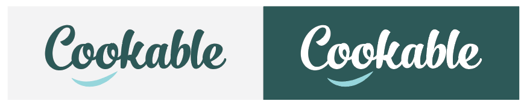

#### Colours
I was exploring colours around more 'mature greens' to evoke feelings of healthy and good quality food in users.

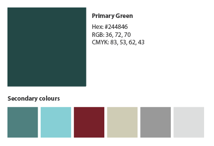

#### Typography
- _Zilla Slab_ font was used  for all headlines.

	Zilla Slab is contemporary slab serif, constructed with smooth curves and true italics, which gives text an unexpectedly sophisticated industrial look and a friendly approachability in all weights.

- _Montserrat_ font was used for all body text.

	Montserrat is very versatile and can be used in multiple domains such as websites, the publishing world, branding, editorial, logos, print, posters, etc. It is a typeface that can be used basically anywhere because of the geometric and elegant simplicity with nice large x-height.

[Back to top](#contents)

---

## Features
### Landing page
Home page for the website, features a brief overview of the Cookable website, a main banner with a call to action to sign up and an advert for "Schmickser" mixer.


&nbsp;

### All Recipes
This page features all recipes uploaded by all registered users. The page is available to view by any visitor to the website. Each recipe is represented by a card with the recipe image and the name.

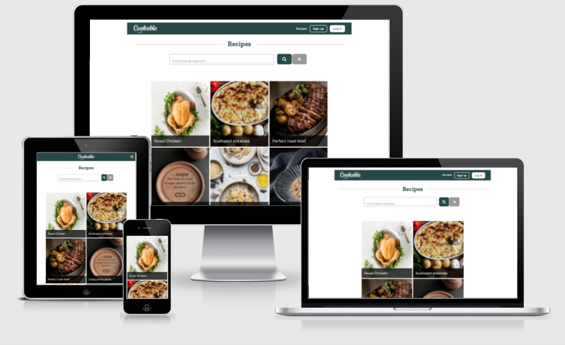

### My Recipes
This page features all recipes uploaded by the user who is currently in session and is available only to that user. It looks similar to the page featuring all recipes. If the current user has not uploaded any recipe yet the appropriate message is displayed.

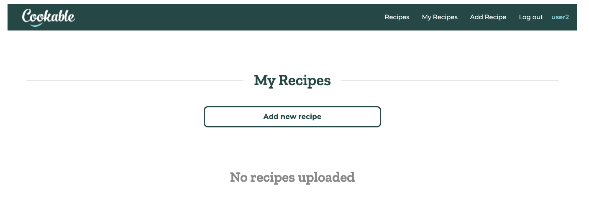
&nbsp;

### Full Recipe page
This page displays the full recipe and includes:
	- recipe name
	- recipe category
	- number of servings
	- cooking time
	- image
	- ingredients
	- preparation method
	- user owner of the recipe

If the full recipe page is being viewed by the user that uploaded the recipe, the aditional options for editing and deleting the recipe are displayed.

Also, if the recipe has 'mix' or 'mixer' keywords in it, the advertisement for 'Schmickser' mixer will appear underneath the recipe.

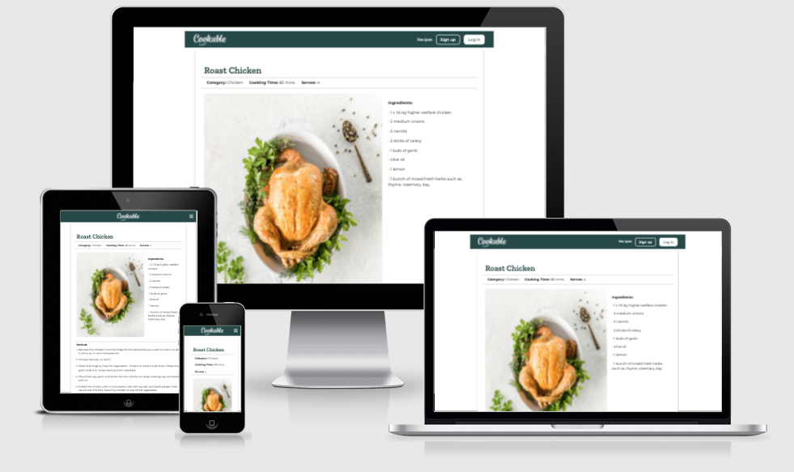
&nbsp;

### Add Recipe
This page presents the user with the form to fill out all the spaces with relevant information to create the recipe.

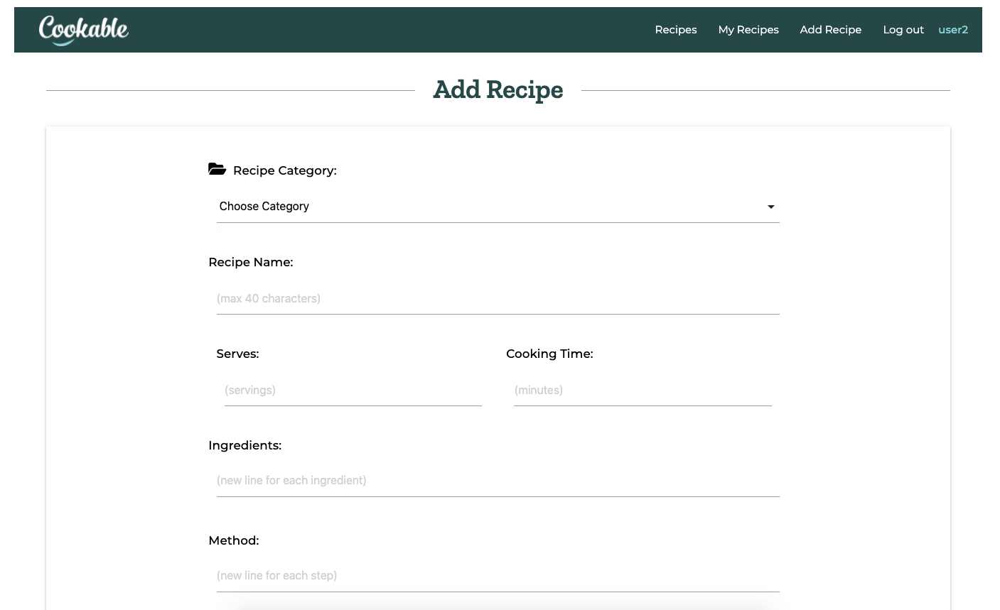
&nbsp;

### Search Recipes
The search bar appears on the page with all recipes. It has the search button (it's equivalent to hitting enter/return on the keyboard) and search reset that simply reloads the page. If the keyword given doesn't appear in any recipe, the message 'No results found' is displayed and all recipes are reloaded underneath.

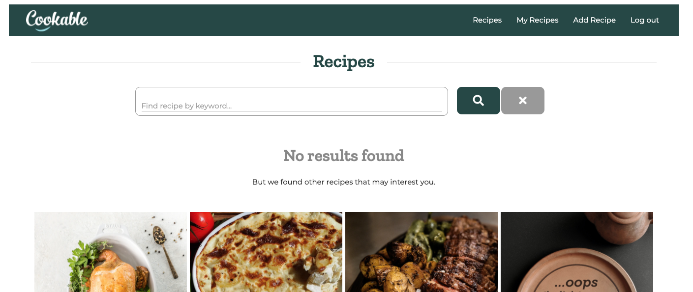
&nbsp;

### Edit Recipe
Comes up after hitting the 'Edit' button on the full recipe that belongs to the user and gives the user similar form as Add Recipe function does, but this time the information is already populated.

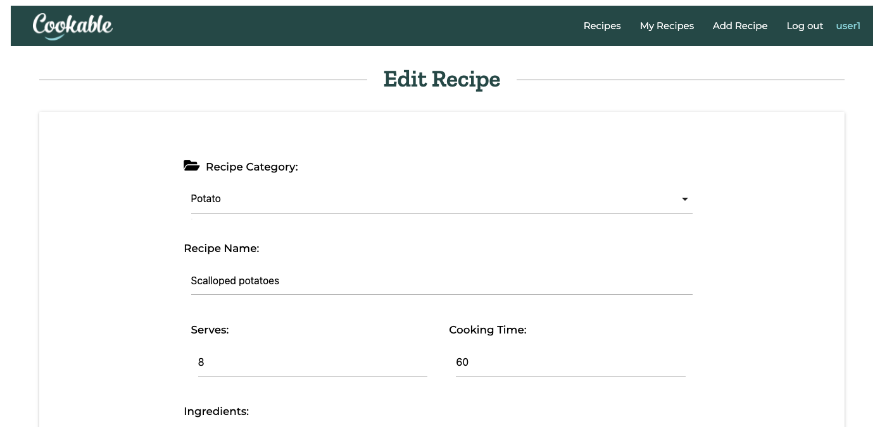
&nbsp;

### Delete Recipe
Deleting recipe is possible after hitting the 'Delete' button on the full recipe that belongs to the user. There is defense mechanism in the form of the modal popping up, which prevents accidental deleting of the recipe by just hitting the 'Delete' button. The modal asks for additional Yes/No confirmation whether the recipe should be deleted.

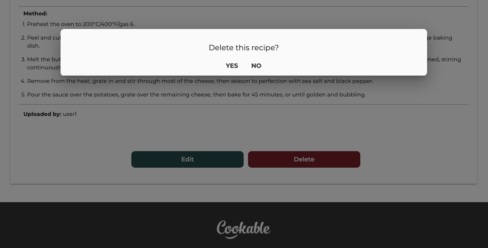
&nbsp;

### Categories
(Create, Read, Update and Delete Categories)

This series of pages is available only to the admin user. They allow admin to view all the recipe categories, add new categories, and edit and delete the old categories. Categories help to bundle up groups of recipes of similar kind under one common keyword (ex. a bunch of icecream recipes could have different ingredients, but they would all come up together in the search under 'dessert' keyword - provided the user used the correct category name).  

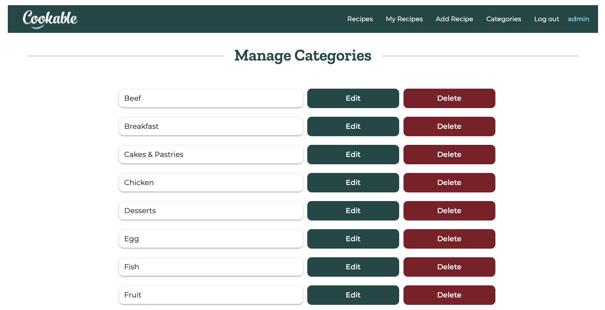
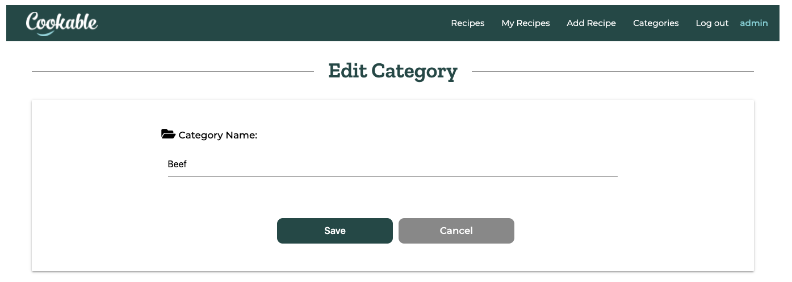
&nbsp;

### Non registered user access
The navigation bar and available links throughout the page let the visitor access all recipes, log in and sign up pages only.


&nbsp;


### Registered user access
The navigation bar and available links throughout the page let the registered user access all recipes, my recipes and add recipe pages. Log in is not available and sign up page is accesible from the home page. The registered user also has also additional privilages of being able to add, edit and delete his/her own recipes.


&nbsp;

### Admin access
Admin can access all the same features as the registered user plus can view, add, edit and delete recipe categories. 


&nbsp;

### Log in
(With validation)

Log in page allows users to log in to their accounts and access registered users' expanded priviliges. The log in form validates the minimum and maximum characters lengths and makes sure that characters entered are within alpha-numeric values only (lowercase and uppercase for letters). If the user doesn't exist or password for user doesn't match database value, then the 'Incorrect username and/or password' message is displayed.

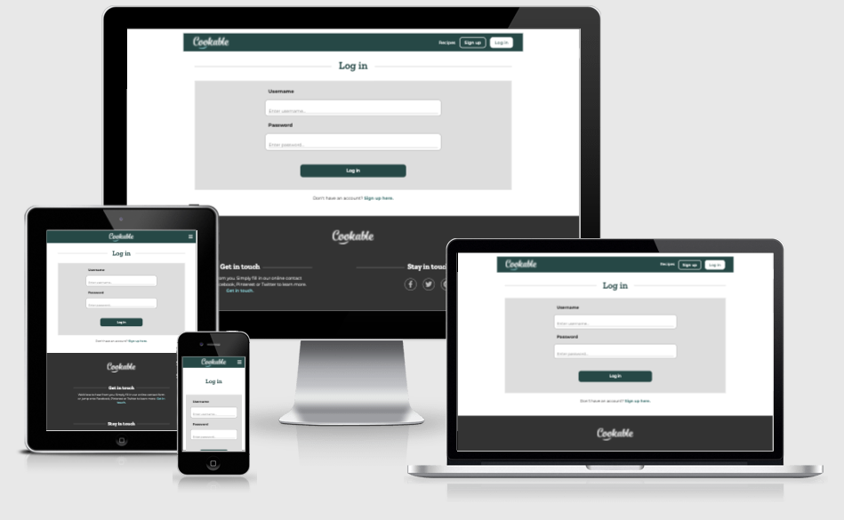
&nbsp;

### Sign up
(With validation and password confirmation)

Sign up page allows visitor to create an account on the website and become a registered user. The sign up form validates the minimum and maximum characters lengths and makes sure that characters entered are within alpha-numeric values only (both lowercase and uppercase for letters).
The password confirmation checks if the 'password' and 'confirm password' fields are the same (at least one character needs to be entered to make sure that the visitor didn't just click through the fields, making 2 empty fields match at equality test) and only then the 'Sig up' button becomes available.

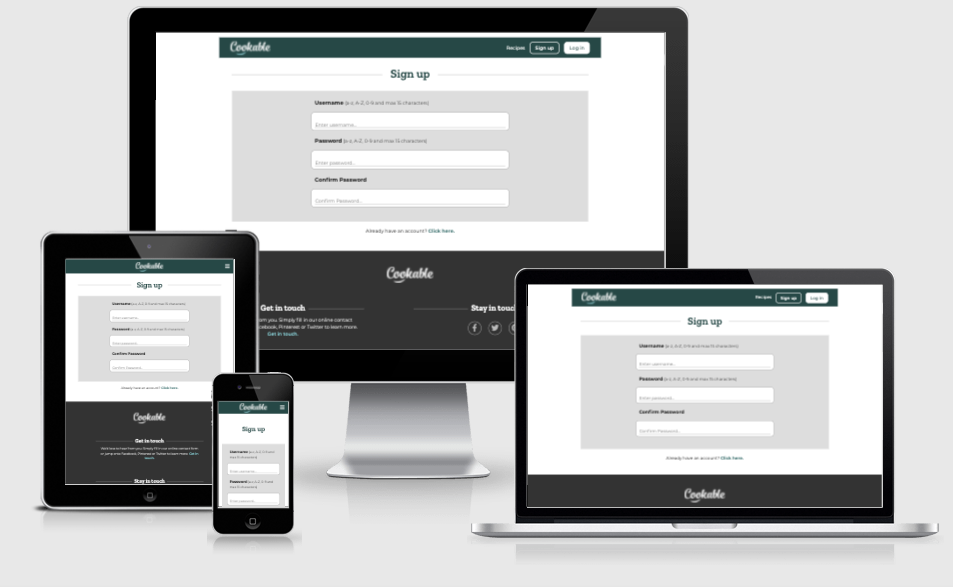
&nbsp;

### Log out
Log out link brings the user back to the basic website without all expanded features available to registered users and admin.
&nbsp;

### Website interaction feedback
Cookable website gives the users feedback when certain actions are taken, especially when these actions are affecting the back-end of the website and the MongoDB database itself, and would not be very apparent at first otherwise. The feedback is manifested as a pop up 'flash' message (lasting 5 seconds). These messages happen when:
- users log in to their accounts, the message: "Welcome, {{user_name}}!"
- users sign up to the website, the message: "You have signed up successfully!"
- users, try to sign up using existing username, the message: "Username already exists"
- users try to log in with incorrect username or password, the message: "Incorrect username and/or password"
- users log out, the message: "You have been logged out"
- users add new recipe, the message: "Recipe Successfully Added"
- users edit the recipe, the message: "Recipe Successfully Updated"
- users, delete the recipe, the message: "Recipe Successfully Deleted"
- admin user adds a new recipe category, the message: "New Category Added"
- admin user edits a recipe category, the message: "Category Successfully Updated"
- admin user deletes a category, the message: "Category Successfully Deleted"
- users send email from the contact page, the message: "Messsage sent successfully". This is the only message not done through Python, but rather with JavaScript.

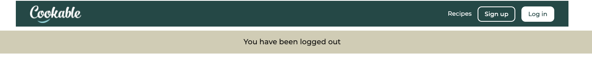
&nbsp;

### Email
Through the contact form on the Contact us page users can send emails to the website owner's mailbox. The feature is supported by EmailJS service.

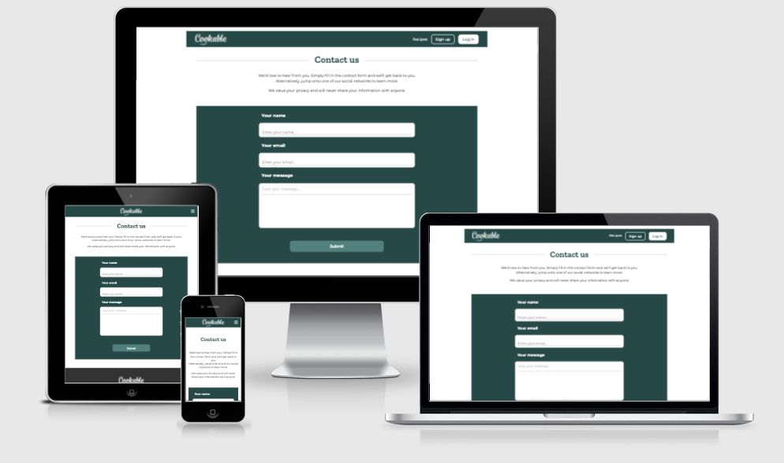
&nbsp;

### Advertising
The home page features an ad for the 'Schmickser' brand of kitchen mixers. This ad gets also inserted on the bottom of each recipe (thinking now.. perhaps positioning of the ad should be better) that contains, anywhere in the text, keywords 'mix' or 'mixer'.

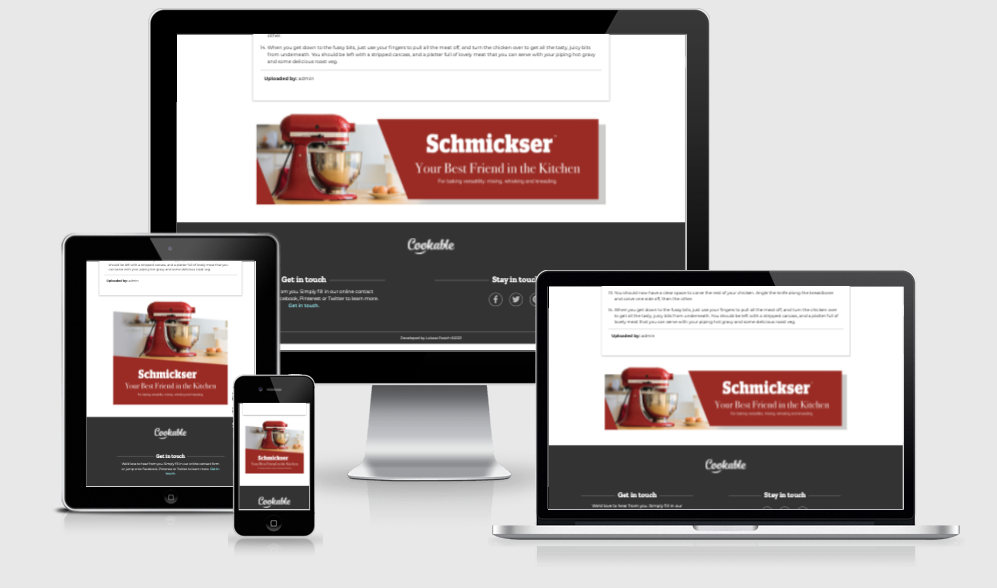
&nbsp;

### Broken image link handling
Because MongoDB supports only textual content, users can add the images to their recipes only by providing URL link to the image hosted on a 3rd party website. In the event of user entering an incorrect link, or in case of the image not being available anymore, a special placeholder image gets inserted instead of the default 'broken image link' icon. The placeholder image is hosted on [www.imgur.com](https://imgur.com/). This image responds to the css styling better than the default 'broken link' icon, blends in better with other images and doesn't break the nice grid layout of the recipe pages.

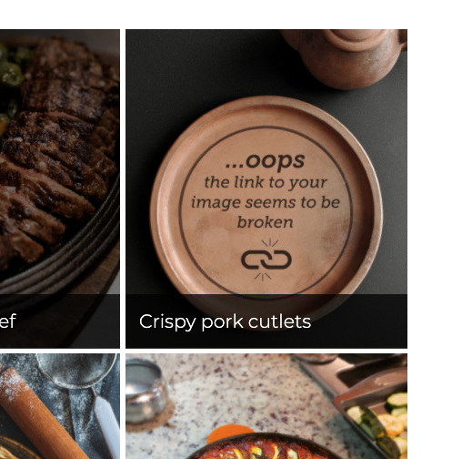
&nbsp;

### Broken URL handling
If the user manually enters incorrect web address, or if 'error 404' happens for any other reason, the website redirects user to the 'Sorry.. Page not found' page. The good thing is that the user is still on the _Cookable_ website.

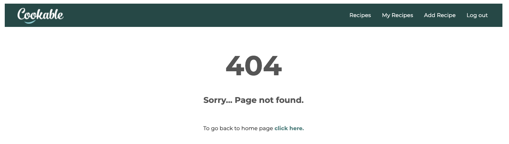
&nbsp;

### Features to Implement in the future
- Nutritional information for each recipe (ex. calorie count, vegan, vegetarian, gluten-free labels).
- Recipe rating feature - for users to rate other users recipes.
- Saving other users recipes.
- Admin dashboard for various recipe statistics.
- Timer (perhaps?)
- Meal planner (perhaps?)


[Back to top](#contents)

---

## Technologies
### Tools
- [GitHub](https://github.com) was an IDE used for the project.
- [GitPod](https://gitpod.io/workspaces/) was used for version control.
- [Heroku](https://heroku.com) was used for website deployment.
- [Balsamiq](https://balsamiq.com) was used to create low fidelity wireframes.
- [Adobe XD](https://www.adobe.com/ie/products/xd.html) was used to build the high fidelity prototypes.
- [Adobe Illustrator](https://www.adobe.com/ie/products/illustrator.html) was used to create logo.
- [Adobe Photoshop](https://www.adobe.com/ie/products/photoshop.html) was used to edit, crop and save images.
- [Adobe InDesign](https://www.adobe.com/ie/products/indesign.html) was used to creadit some of the graphics for the website (ex. 'Schmickser' ad).
- [Am I Responsive](http://ami.responsivedesign.is) was used to create the images of each page displayed on different screen sizes in this _Readme_ file.

### Libraries and frameworks
- [Flask](https://flask.palletsprojects.com/en/2.0.x/) was used as a Python framework. A number of features was imported from flask - render_templates amongst one of them.
- [jQuery](https://jquery.com/) was used as JavaScript framework. A number of components from Materialize was activated via jQuery.
- [Werkzeug](https://werkzeug.palletsprojects.com/en/2.0.x/) tool was used for hashing and unhashing back the passwords.
- [Materialize](https://materializecss.com/) grids were used in particular to create and maintain the design layout across different screen/viewport sizes and make the website responsive easily. Some dynamic components from Materialize were also used.
- [Google Fonts](https://fonts.google.com) was used to link the "Montserrat" and "Zilla Slab" fonts.
- [Font Awesome](https://fontawesome.com) was used for icons.

### Languages
- HTML5
- CSS3
- JavaScript
- Python

### Database platform
- MongoDB - a NoSQL database cloud-based program - was used to store data captured from the user.

[Back to top](#contents)

---

## Testing

### Automated Testing
- [W3C Markup Validator](https://validator.w3.org/) was used for HTML validation:
	- _Home page_ validator result [HERE](https://validator.w3.org/nu/?doc=https%3A%2F%2Fcookable.herokuapp.com%2Flanding) - Errors: 0
	- _Recipes page_ validator result [HERE](https://validator.w3.org/nu/?doc=https%3A%2F%2Fcookable.herokuapp.com%2Fget_recipes) - Errors: 3 (deliberate 3 broken links for test purposes)
	- _Full recipe page_ validator result [HERE](https://validator.w3.org/nu/?doc=https%3A%2F%2Fcookable.herokuapp.com%2Ffull_recipe) - Errors: 0
	- _My recipes page_ validator result [HERE](https://validator.w3.org/nu/?doc=http%3A%2F%2Fcookable.herokuapp.com%2Fmy_recipes) - Errors: 0
	- _Edit recipe page_ validator result [HERE](https://validator.w3.org/nu/?doc=http%3A%2F%2Fcookable.herokuapp.com%2Fedit_recipe) - Errors: 0
	- _Add recipe page_ validator (via direct input, as page password protected) result - Errors: 0
	- _Categories page_ validator (via direct input, as page password protected) result - Errors: 0
	- _Edit category page_ validator (via direct input, as page password protected) result - Errors: 0
	- _Add category page_ validator (via direct input, as page password protected) result - Errors: 0
	- _Sign up page_ validator result [HERE](https://validator.w3.org/nu/?doc=https%3A%2F%2Fcookable.herokuapp.com%2Fsignup) - Errors: 0
	- _Log in page_ validator result [HERE](https://validator.w3.org/nu/?doc=https%3A%2F%2Fcookable.herokuapp.com%2Flogin) - Errors: 0
	- _Contact page_ validator result [HERE](https://validator.w3.org/nu/?doc=https%3A%2F%2Fcookable.herokuapp.com%2Fcontact) - Errors: 0
	- _Error 404 page_ validator result [HERE](https://validator.w3.org/nu/?doc=https%3A%2F%2Fcookable.herokuapp.com%2Fcontacta) - Errors: 0

&nbsp;

- [W3C CSS Validator](https://jigsaw.w3.org/css-validator/) was used for CSS validation:
	- CSS validation result [HERE](https://jigsaw.w3.org/css-validator/validator?uri=https%3A%2F%2Fcookable.herokuapp.com%2Fstatic%2Fstyle%2Fstyle.css&profile=css3svg&usermedium=all&warning=1&vextwarning=&lang=en) - Errors: 1 (error related to Materialize library)

&nbsp;

- [JSHint](https://jshint.com/) was used for JavaScript validation (New JavaScript features (ES6) and jQuery were selected in configuration):
    - script.js - JavaScript validation - Errors: 0
	- sendEmail.js - JavaScript validation - Errors: 0

&nbsp;

- [Web Accessibility](https://www.webaccessibility.com) was used to validate website's accessibility:
	- _Home page_ website accessibility score: 100%
	- _Recipes page_ website accessibility score: 100%
	- _Full recipe page_ website accessibility score: 100%
	- _My recipes page_ - password protected, could not be assessed
	- _Edit recipe page_ - password protected, could not be assessed
	- _Add recipe page_ - password protected, could not be assessed
	- _Categories page_ - password protected, could not be assessed
	- _Edit category page_ - password protected, could not be assessed
	- _Add category page_ - password protected, could not be assessed
	- _Sign up page_ website accessibility score: 100%
	- _Log in page_ website accessibility score: 100%
	- _Contact page_ website accessibility score: 98%
	- _Error 404 page_ website accessibility score: 100%

&nbsp;

    
- [Google Mobile Friendly Test](https://search.google.com/test/mobile-friendly) was used to test responsiveness of the website:
	- _Home page_ - mobile friendly
	- _Recipes page_ - mobile friendly
	- _Full recipe page_ - mobile friendly
	- _My recipes page_ - password protected, could not be assessed
	- _Edit recipe page_ - password protected, could not be assessed
	- _Add recipe page_ - password protected, could not be assessed
	- _Categories page_ - password protected, could not be assessed
	- _Edit category page_ - password protected, could not be assessed
	- _Add category page_ - password protected, could not be assessed
	- _Sign up page_ - mobile friendly
	- _Log in page_ - mobile friendly
	- _Contact page_ - mobile friendly
	- _Error 404 page_ - mobile friendly

&nbsp;
	
- Python code was verified through GitPod's linter, showing only 1 error:
```	
"env" imported but unused
```
This has to do with the fact that env.py file contains all the sensitive data and could not be pushed to GitHub repository.

&nbsp;

### UX Testing
#### User Stories Testing

1. As a first time user I want the website to ...
    - content ...


### Manual Testing
#### Features Working Correctly (in various screen sizes) Check
- Home Page:
    - _Home_ link-button in the header links to _Home_ page - YES
    - ...

#### Various Internet Browsers Check

Website has been tested on the following Internet Browsers:

- Google Chrome - no issues detected
- Safari - no issues detected
- Mozilla Firefox - no issues detected
- Microsoft Edge - no issues detected
	
#### Various Devices Check

Game has been checked on Desktop, Laptop, iPhone5 and iPhone6.
No issues specific to devices were discovered.
	
### Bugs

#### Bugs Fixed
1.	- PROBLEM:

        content ...
        
        

	- SOLUTION:
    
        content ...
    
        ```
        JS

        code block
        ```
    
#### Bugs not Fixed
I was able to fix all of the problems that I was aware of.

[Back to top](#contents)

### Username on the navbar
This is clumsily implemented at the moment as the username appears only on pages rendered by functions that take _username_ argument anyway. All pages that 

---


## Deployment

### GitHub Pages Deployment

The project was deployed to GitHub Pages using the following steps...

1. Log in to GitHub and locate the [GitHub Repository](https://github.com).
2. At the top of the Repository, locate the _Settings_ button on the menu and click on it.


3. Scroll down the Settings page until you locate the _GitHub Pages_ section.

4. Under _Source_, click the dropdown _Branch: None_ and select _Branch: Master_.


5. The page will automatically refresh.
6. Scroll back down through the page to locate the now published site link in the _GitHub Pages_ section.


7. The project has been now deployed - the link can be opened in the browser.


### Cloning

1. Find this project [repository](https://github.com/LukaszPasich/Now-We-Flip-MS2-) on github.
2. Under the repository name, click on "Code" button.
3. In the Clone/ Download unfolded tab click on HTTPS (to clone with HTTPS).
4. Click on the 'clipboard' icon to copy the URL of your project.


5. Open your IDE, open terminal.
6. Change the current working directory to the location where you want the cloned directory.
7. In the terminal type <code>git clone</code>, and then paste the URL you copied earlier.
```
$ git clone https://github.com/YOUR-USERNAME/YOUR-REPOSITORY
```
8. Press _ENTER_ to create your local clone.


[Back to top](#contents)


---

## Credits
### Content
content ...


### Media
- image - by artist, downloaded from [www.vecteezy.com](https://www.vecteezy.com/...)

### Code
- Feature taken from this tutorial: [https://www.youtube.com/...](https://www.youtube.com/...), (script.js file, array declared in line 013).

### Resources
Websites I have accessed for solutions/ questions and extra resources:
- [www.w3schools.com](https://www.w3schools.com)
- [www.stackoverflow.com](https://stackoverflow.com)
- [www.developer.mozilla.org](https://developer.mozilla.org/en-US/)
- [www.css.tricks.com](https://css-tricks.com)
- [Code Institute course content](https://codeinstitute.net/)
- [Kevin Powell youtube channel](https://www.youtube.com/user/KepowOb)
- [Web Dev Simplified youtube channel](https://www.youtube.com/c/WebDevSimplified)

### Acknowledgements
- Thank you to my mentor __Nishant Kumar__ for his guidance, support and continuous helpful feedback throughout this project.
- Tutor Support at Code Institute and the Slack Community for a solution to any question at any time.

[Back to top](#contents)

---

## Contact
For any queries related to this project, you can contact me at: lukas (dot) zed81 (at) gmail (dot) com.

[Back to top](#contents)

---

## THANK YOU FOR TAKING TIME TO VIEW THIS PROJECT!